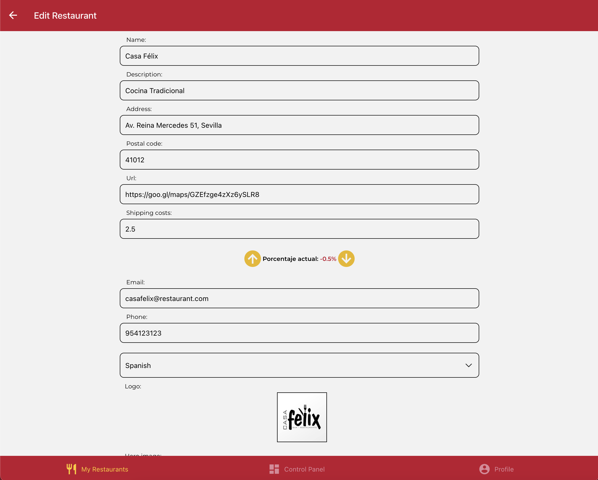
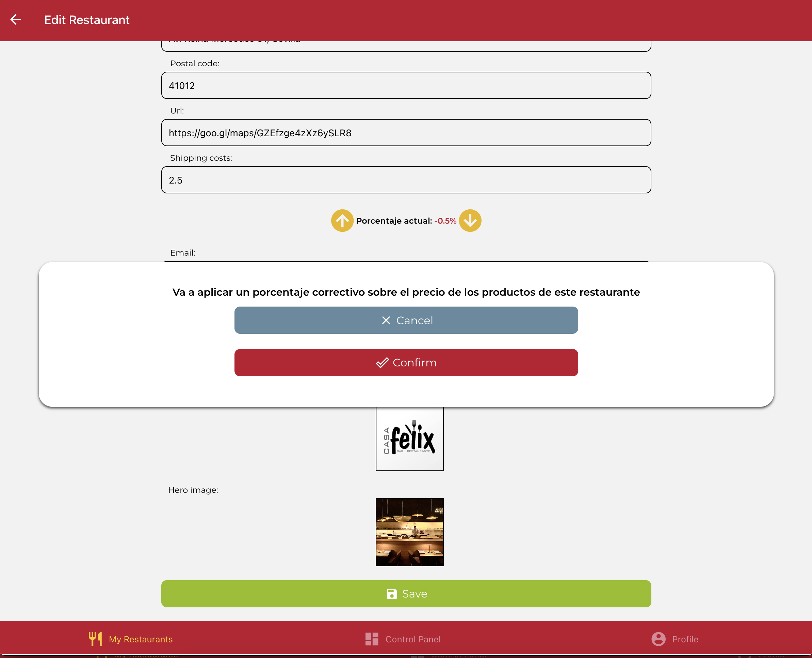
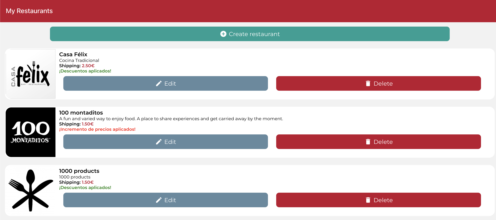

# IISSI-2 IS: Examen de laboratorio Junio 2024.

## Final Liga de Campeones. Enunciado

Ante eventos televisivos masivos como la Fórmula 1 o los partidos de Liga de Campeones, durante los cuales se produce un incremento de pedidos en los restaurantes, hemos decidido incluir una nueva funcionalidad para los propietarios de los establecimientos. Mediante un cambio en la interfaz de la edición de restaurantes, los propietarios podrán modificar el precio de todos los productos de un restaurante en cuestión de segundos.

- El acceso rápido consistirá en dos botones (flecha arriba y flecha abajo) en la vista de edición de restaurantes, que permiten modificar (incrementar o decrementar) el porcentaje que desea aplicarse al precio base de todos los productos del restaurante en cuestión. Este porcentaje puede ser positivo, lo que implica que se incrementa el precio base, o negativo, que implica un descuento sobre el precio base del producto. Por defecto, el valor de este campo será 0.
- Al pulsar sobre cada uno de los botones, el porcentaje se incrementará o decrementará en más/menos 0.5% con respecto al valor anterior de esta propiedad llamada 'percentage'.
- Una vez finalizados los cambios, el propietario pulsará sobre el botón guardar del formulario de edición de restaurante. Al pulsar este botón, el backend deberá actualizar no sólo la propiedad porcentaje del restaurante, sino también el precio de todos los productos de este, incrementando o decrementando el precio base en el porcentaje indicado. En caso de que el valor del campo sea distinto a 0, la aplicación debe pedir confirmación al propietario antes de guardar los cambios; utilice para ello el componente suministrado `ConfirmationModal`, similar al componente `DeleteModal` utilizado en clase.
- Debe crear una nueva propiedad llamada 'basePrice' en la entidad Product. Esta propiedad siempre contendrá el precio original del producto y tan sólo debe modificarse en los métodos create y update de ProductController. Tenga en cuenta que estos cambios ya se encuentran implementados en el proyecto base.
- Al modificar el porcentaje, los productos pasarán a tener un precio igual al precio base más el porcentaje indicado:
- - precio_final = precio_base \* (1 + (porcentaje_actual / 100))
- De ese modo un producto que valga 4 euros podrá pasar por los siguientes estados:
- - Cambio +3%: precio_base=4; precio_final=4\*(1+(3/100))=4.12
- - Cambio -2%: precio_base=4; precio_final=4\*(1+(-2/100))=3.92
- - Cambio 0%: precio_base=4; precio_final=4\*(1+(0/100))=4

- Por último, en el listado de restaurantes, aquellos restaurantes que tengan un porcentaje modificador del precio de los productos distinto a 0, deberán mostrar una etiqueta que lo indique: ¡Incremento de precio aplicado! o ¡Descuento aplicado! en función de si el porcentaje es mayor o menor que 0.

Tenga en cuenta que este cambio DEBE persistir el precio del producto en la base de datos, aplicando el nuevo precio al listado de productos de dicho restaurante individualmente. Esto hará que todas las consultas relacionadas con dichos productos reciban la información actualizada. **Se valorará el uso de transacciones.**

Existe una limitación en el porcentaje para evitar incrementos u ofertas muy agresivas, de manera que el nuevo campo sólo podrá contener valores decimales entre -5 y 5 (excluidos ambos valores). Deberá asegurarse de que esta restricción se cumple tanto en el formulario de edición como en el método adecuado en el backend.

### Ejercicio 1

Realice todos los cambios necesarios en el proyecto de backend para implementar el nuevo requisito. Los test de backend esperan que la ruta sea: `PUT /restaurants/:restaurantId` y `GET /restaurants/:restaurantId/products`

Recuerde que puede correr los tests con:

```Bash
npm run test:backend
```

### Ejercicio 2

Realice todos los cambios necesarios en el proyecto de frontend para implementar el nuevo requisito.

Puede renderizar los iconos de las flechas hacia arriba y hacia abajo del siguiente modo:

```HTML
<MaterialCommunityIcons
  name={'arrow-up-circle'}
  color={GlobalStyles.brandSecondaryTap}
  size={40}
/>
```

```HTML
<MaterialCommunityIcons
  name={'arrow-down-circle'}
  color={GlobalStyles.brandSecondaryTap}
  size={40}
/>
```







### Puntuación

#### Tarea 1: Backend

- RF1. Crear la propiedad basePrice del producto. (0.5 puntos)
- RF2. Persistir la propiedad porcentaje asociada al restaurante. (1.5 puntos)
- RF3. Actualizar el precio de los productos al modificar el porcentaje del restaurante. (2 puntos)
- RF4. Realizar un uso adecuado de las transacciones. (1 punto)
- RF5. Devolver el listado de productos con el precio actualizado en los endpoints implicados (1 punto)

#### Tarea 2: Frontend

- RF1. Integración de los botones para subir y bajar el porcentaje del restaurante en el frontend.
  - RF1.1. Integración visual de los botones en la vista correspondiente. (0,5 puntos)
  - RF1.2. Funcionalidad de actualización de precios realizada correctamente. (1 punto)
  - FR1.3. Controlar las restricciones en los campos de manera adecuada. (0,5 puntos)
- RF2. Mostrar en el listado de restaurantes la etiqueta correcta en caso de que exista un porcentaje aplicado (1 punto)
- RF3. Petición de confirmación al propietario antes de guardar los cambios (0.5 puntos)
- Global. Corrección visual: iconos, diseño, modales, etc. (0.5 puntos)

## Proyecto base suministrado

Este repositorio incluye el backend completo (carpeta `DeliverUS-Backend`) y el frontend de `owner` (carpeta `DeliverUS-Frontend-Owner`). Servirá como base para realizar el examen de laboratorio de la asignatura.

## Preparación del entorno

### a) Windows

- Abra un terminal y ejecute el comando `npm run install:all:win`.

### b) Linux/MacOS

- Abra un terminal y ejecute el comando `npm run install:all:bash`.

## Ejecución

### Backend

- Para **rehacer las migraciones y seeders**, abra un terminal y ejecute el comando

  ```Bash
  npm run migrate:backend
  ```

- Para **ejecutarlo**, abra un terminal y ejecute el comando

  ```Bash
  npm run start:backend
  ```

### Frontend

- Para **ejecutar la aplicación frontend de `owner`**, abra un nuevo terminal y ejecute el comando

  ```Bash
  npm run start:frontend:owner
  ```

## Depuración

- Para **depurar el backend**, asegúrese de que **NO** existe una instancia en ejecución, pulse en el botón `Run and Debug` de la barra lateral, seleccione `Debug Backend` en la lista desplegable, y pulse el botón de _Play_.

- Para **depurar el frontend**, asegúrese de que **EXISTE** una instancia en ejecución del frontend que desee depurar, pulse en el botón `Run and Debug` de la barra lateral, seleccione `Debug Frontend` en la lista desplegable, y pulse el botón de _Play_.

## Test

- Para comprobar el correcto funcionamiento de backend puede ejecutar el conjunto de tests incluido a tal efecto. Para ello ejecute el siguiente comando:

      ```Bash
      npm run test:backend
      ```

  **Advertencia: Los tests no pueden ser modificados.**

## Problemas con los puertos

En ocasiones, los procesos de backend o frontend, con o sin depuración, pueden quedarse bloqueados sin liberar los puertos utilizados, impidiendo que puedan ejecutarse otros procesos. Se recomienda cerrar y volver a iniciar VSC para cerrar dichos procesos.

## Procedimiento de entrega

1. Borrar las carpetas **node_modules** de backend y frontend y **.expo** del frontend.
1. Crear un ZIP que incluya todo el proyecto. **Importante: Comprueba que el ZIP no es el mismo que te has descargado e incluye tu solución**
1. Avisa al profesor antes de entregar.
1. Cuando el profesor te dé el visto bueno, puedes subir el ZIP a la plataforma de Enseñanza Virtual. Espera a que la plataforma te muestre un enlace al ZIP antes de pulsar el botón de aceptar.